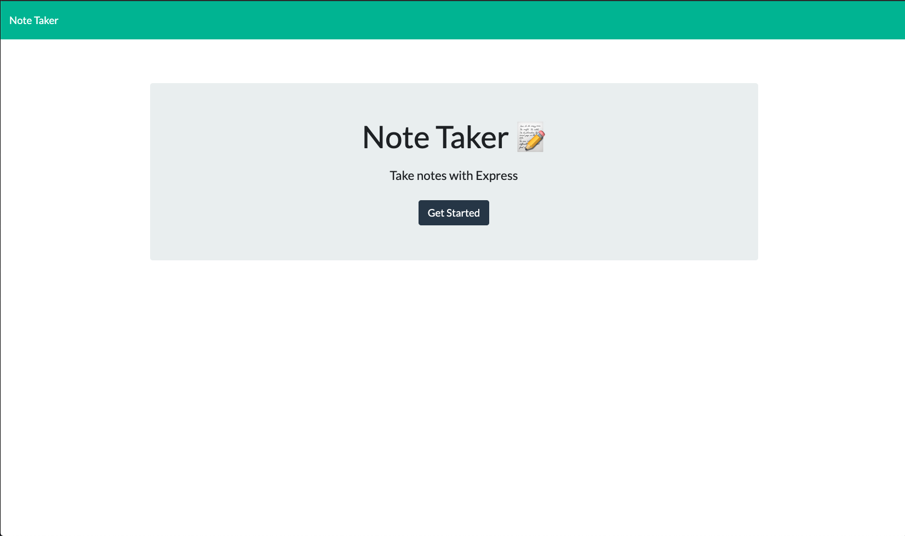
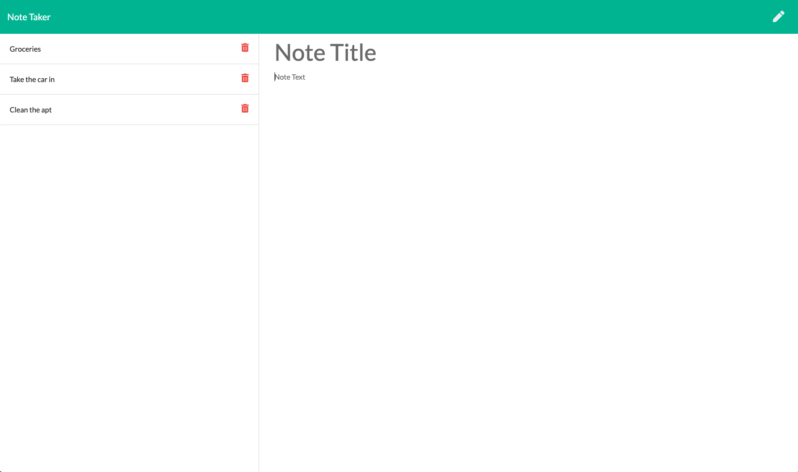

## Note Taker

[](https://lbesson.mit-license.org/)

- [Description ](#description)
- [Installation and Usage](#installation-and-use)
- [License](#license)




# Description

The user is brough to a landing page form which they can access the 'Notes' page. Once loaded, the 'Notes' page displays a column of saved notes, a main body that either displays a selected note or allow sthe user to input a new note, as well as a header with buttons to save or write new notes.

If the main body displays the default content of "Note Title / Note Text", then the user can simply click on each field to start typing in the decriptions. If the user wants to view the details of a note, they can click on the title on the left-hand side to bring the full note into the body view.

If they want to add a new note after viewing an existing note, they simply click the pencil button in the header to reset the fields. Finally, once a note is ready to be saved, the user can click on the save button that appears in the header. Note - both fields need to have some content in order to save a new note.

Finally, when a note is ready to be deleted, simply click on the red trash can icon that is on the same line as the note.

The app makes use of an index.js file to handle the front end functionality, server.js file to handle the back end paths, and db.json file to handle the storage of the active note list.

This page has been deployed on Heroku and can be viewed here: https://murmuring-mesa-88838.herokuapp.com/

# Installation and Use

Clone the repo and open the folder in the code editor of your choice.

Install the necessary dependencies:

```
npm i
```

start the server:

```
npm start
```

and direct your browser to http://localhost:3000

# License

[MIT License](https://opensource.org/licenses/MIT)
